<!-- Theme-aware oscilloscope banner — self-hosted, animated (SMIL). -->
<div align="center">

<picture>
  <source media="(prefers-color-scheme: dark)" srcset="./assets/banner-dark.svg">
  <source media="(prefers-color-scheme: light)" srcset="./assets/banner-light.svg">
  
</picture>

<sub>

[`focus`](#-focus) · [`reverse-engineering`](#-reverse-engineering) · [`stack`](#-stack) · [`projects`](#-featured-projects) · [`activity`](#-activity) · [`contact`](#-contact)

</sub>

</div>

<br/>

## `~` focus

```console
$ whoami
William Ho — Computer Engineering @ Cal Poly San Luis Obispo

$ cat focus.txt
I build firmware that makes hardware play hi-res sound —
multi-codec Bluetooth audio, real-time DSP, and the occasional
reverse-engineered codec running bare-metal on an ESP32.

$ ls ~/interests
hardware/software boundary   low-latency wireless audio   embedded DSP
```

- **Now** — multi-codec A2DP firmware for the ESP32 family: LDAC, aptX / HD / LL, LHDC V5, AAC, Opus, LC3plus, SBC
- **Depth** — real-time DSP: equalizers, bass boost, level meters, clock sync, packet-loss concealment
- **Reach** — Android companion apps (Kotlin / Flutter) that drive it all over BLE — EQ, codec selection, OTA, live visualization
- **Learning** — ESP-IDF internals, FreeRTOS scheduling, and squeezing hi-res codecs onto internal SRAM

<br/>

## `>` reverse-engineering

> ### [`LHDC-V5-Decoder`](https://github.com/WillyBilly06/LHDC-V5-Decoder)
> I reverse-engineered the proprietary **LHDC V5** hi-res Bluetooth codec — digging through binaries until it
> became a working decoder that runs on an ESP32, wired straight into the A2DP audio pipeline.
> A microcontroller playing hi-res audio nobody documented. 🎧

<br/>

## `#` stack

<!-- Datasheet-style spec sheet instead of a badge wall — reads like the hardware it describes. -->
```text
Languages    C  ·  C++  ·  Kotlin  ·  Dart
Embedded     ESP-IDF  ·  FreeRTOS  ·  Arduino  ·  CMake
Wireless     Bluetooth A2DP / BLE GATT  ·  ESP-NOW
Codecs       LDAC · aptX HD/LL · LHDC V5 · LC3plus · Opus · AAC · SBC
DSP          3-band EQ · Bass Boost · Level Meters · PLC · Clock Sync · Adaptive Buffering
Mobile       Android (Kotlin)  ·  Flutter
Tooling      Git  ·  Android Studio  ·  Logic / Signal Analysis
```

<br/>

## `*` featured projects

| Project | Stars | What it is |
|---|---|---|
| 🎚️ **[ESP32-S31-A2DP-Codecs](https://github.com/WillyBilly06/ESP32-S31-A2DP-Codecs)** | [](https://github.com/WillyBilly06/ESP32-S31-A2DP-Codecs/stargazers) | Multi-codec A2DP sink on ESP-IDF v6.1 — LDAC, aptX/HD/LL, LHDC V5, Opus, LC3plus, AAC, SBC — all on internal SRAM |
| 🔊 **[esp32-a2dp-sink-with-LDAC-APTX-AAC](https://github.com/WillyBilly06/esp32-a2dp-sink-with-LDAC-APTX-AAC)** | [](https://github.com/WillyBilly06/esp32-a2dp-sink-with-LDAC-APTX-AAC/stargazers) | A2DP audio sink with BLE GATT control, DSP, level meters and LDAC |
| 🎼 **[LHDC-V5-Decoder](https://github.com/WillyBilly06/LHDC-V5-Decoder)** | [](https://github.com/WillyBilly06/LHDC-V5-Decoder/stargazers) | Reverse-engineered LHDC V5 decoder, integrated into the ESP32 A2DP pipeline |
| 📱 **[BDK-AUDIO-APP](https://github.com/WillyBilly06/BDK-AUDIO-APP)** | [](https://github.com/WillyBilly06/BDK-AUDIO-APP/stargazers) | Android control app — DSP/EQ, codec selection, LED effects, OTA over BLE |
| 🖥️ **[NVFLASH](https://github.com/WillyBilly06/NVFLASH)** | [](https://github.com/WillyBilly06/NVFLASH/stargazers) | Patched NVFlash supporting RTX 50-series GPU BIOS flashing |

<div align="center">

**[· browse all repositories ·](https://github.com/WillyBilly06?tab=repositories)**

</div>

<br/>

## `~` activity

<div align="center">

<!-- github-profile-summary-cards is a self-hosted-per-request generator that stays reliable
     where the shared github-readme-stats instance gets rate-limited. tokyonight ≈ the cyan banner. -->


<br/><br/>

<!--RECENT_REPO:START-->
🛠️ Most recently pushed to <a href="https://github.com/WillyBilly06/LHDC-V5-Decoder"><b>LHDC-V5-Decoder</b></a> on <b>2026-07-22</b><br/>
<i>LHDC V5 Decoder For ESP32's A2DP Integration</i><br/>
<code>C</code>
<!--RECENT_REPO:END-->

<sub><i>· auto-updates via GitHub Actions ·</i></sub>

</div>

<br/>

## `@` contact

<div align="center">

[](https://www.linkedin.com/in/ngoc-viet-ho-13a098190/)
[](https://github.com/WillyBilly06)
<!-- Uncomment to publish your email:
[](mailto:YOUR_EMAIL)
-->

<br/>


<br/><br/>

<sub><code>$ echo "building things that make sound 🔊"</code></sub>

</div>
